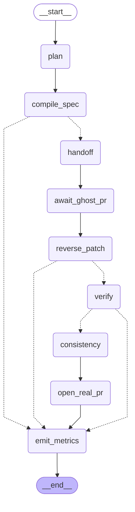
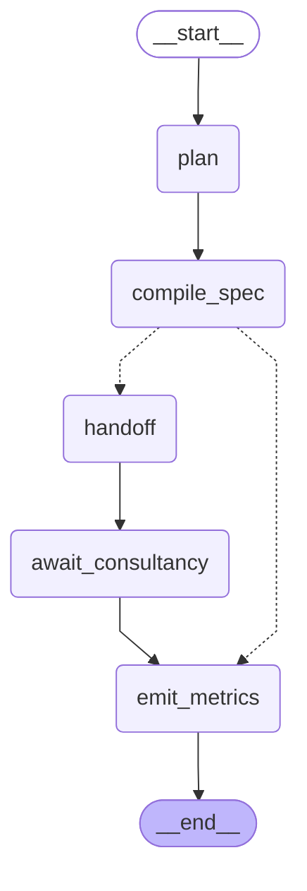

# Client agent — LangGraph

Auto-generated by `ghostc-agent print-graph`. Topology in `client_agent/graph.py::_wire`.

## Full pipeline (`run-task`)

## Reduced flow (`client-agent start`, hook-triggered, real repos)

`handoff` commits + `git push -f origin` on `../ghostc-demo/ghost`; the bare origin's `post-receive` hook runs the consultancy agent against its own clone; `await_consultancy` fetches the branch back. No forge, no PR.

The reverse-compile back to the real repo is a **separate** command, `client-agent open-real-pr <spec>` (`client_agent/reverse_pr.py`) — run after the consultancy has developed the ghost branch. It is not a graph node: it simulates a forge webhook firing into the company boundary (`git diff <handoff>..origin/ghostc/task/<id>` → `reverse_patch` → a decoded `ghostc/real/<name>` branch on `../ghostc-demo/real`).

## Nodes

| node | what it does | audit event(s) |
|---|---|---|
| `plan` | start the run, record backend + start time | `agent.task_started` |
| `compile_spec` | `ghostc.spec.compile_spec` → sanitized `TASK.md`. **Fail-closed gate.** | `spec.compiled` / `spec.rejected` |
| `handoff` | *(reduced)* in `../ghostc-demo/ghost`: branch `ghostc/task/<id>`, commit the sanitized `TASK.md` as `ghostc-client`, `git push -f origin` — which fires the bare origin's `post-receive` hook. *(full)* same via `LocalBareForge`. | `agent.spec_handoff` |
| `await_consultancy` | *(reduced)* `git fetch origin`; confirm the hook's consultancy run pushed a commit on top of the `TASK.md` commit; `git branch -f` so it is checkoutable; record authors | `agent.consultancy_developed` |
| `await_ghost_pr` | *(full)* consultancy implements + opens a **ghost PR** (`consultancy_agent.sim`) | `agent.ghost_pr_opened` |
| `reverse_patch` | *(full)* `ghostc.patch.reverse_patch` ghost diff → real diff. **Fail-closed gate.** | `patch.*` |
| `verify` | *(full)* `git apply --check` the real diff against the real repo | `verify.scan` / `verify.pass` / `verify.block` |
| `consistency` | *(full)* LLM verdict: real diff vs. task | `consistency.verdict` |
| `open_real_pr` | *(full)* apply the real diff, open a **real-repo PR**, flag for human review | `agent.real_pr_opened`, `approval.requested` |
| `emit_metrics` | assemble the metrics row; also the sink for every fail-closed short-circuit | `agent.metrics`, `agent.task_completed` |

Dotted edges are the fail-closed short-circuits: on any `Rejection` / block the run skips straight to `emit_metrics` and **no PR is opened**. `handoff` is the only node that writes to the ghost side — the privacy boundary is on that wire.
