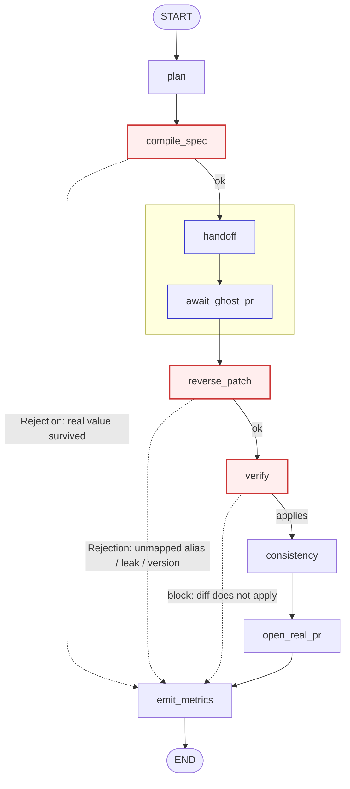

# Client agent — LangGraph `StateGraph`

Topology defined in `client_agent/graph.py::_wire`. Node bodies in
`build_client_graph`. Regenerate the auto-rendered version with
`ghostc-agent print-graph` (overwrites this file); the hand annotations below the
diagram are the canonical explanation.

## Nodes

| node | what it does | audit event(s) |
|---|---|---|
| `plan` | start the run, record backend + start time | `agent.task_started` |
| `compile_spec` | `ghostc.spec.compile_spec` → sanitized `TASK.md`. **Fail-closed gate.** | `spec.compiled` / `spec.rejected` |
| `handoff` | commit `TASK.md` on `ghostc/task/<id>` of the **ghost remote**, push | `agent.spec_handoff` |
| `await_ghost_pr` | consultancy implements + opens a **ghost PR** (Phase B: `consultancy_agent.sim`; Phase D: `interrupt()` + git hook) | `agent.ghost_pr_opened` |
| `reverse_patch` | `ghostc.patch.reverse_patch` ghost diff → real diff. **Fail-closed gate.** | `patch.*` |
| `verify` | `git apply --check` the real diff against the real repo | `verify.scan` / `verify.pass` / `verify.block` |
| `consistency` | LLM (`bridge.llm`) verdict: real diff vs. task | `consistency.verdict` |
| `open_real_pr` | apply the real diff, open a **real-repo PR**, flag for human review | `agent.real_pr_opened`, `approval.requested` |
| `emit_metrics` | assemble the metrics row; also the sink for both fail-closed short-circuits | `agent.metrics`, `agent.task_completed` |

Dotted edges are the fail-closed short-circuits: on any `Rejection` / block the run
skips straight to `emit_metrics` and **no real PR is opened**. `handoff` +
`await_ghost_pr` (blue) are the only nodes that touch the ghost remote — the
privacy boundary is on that wire.
